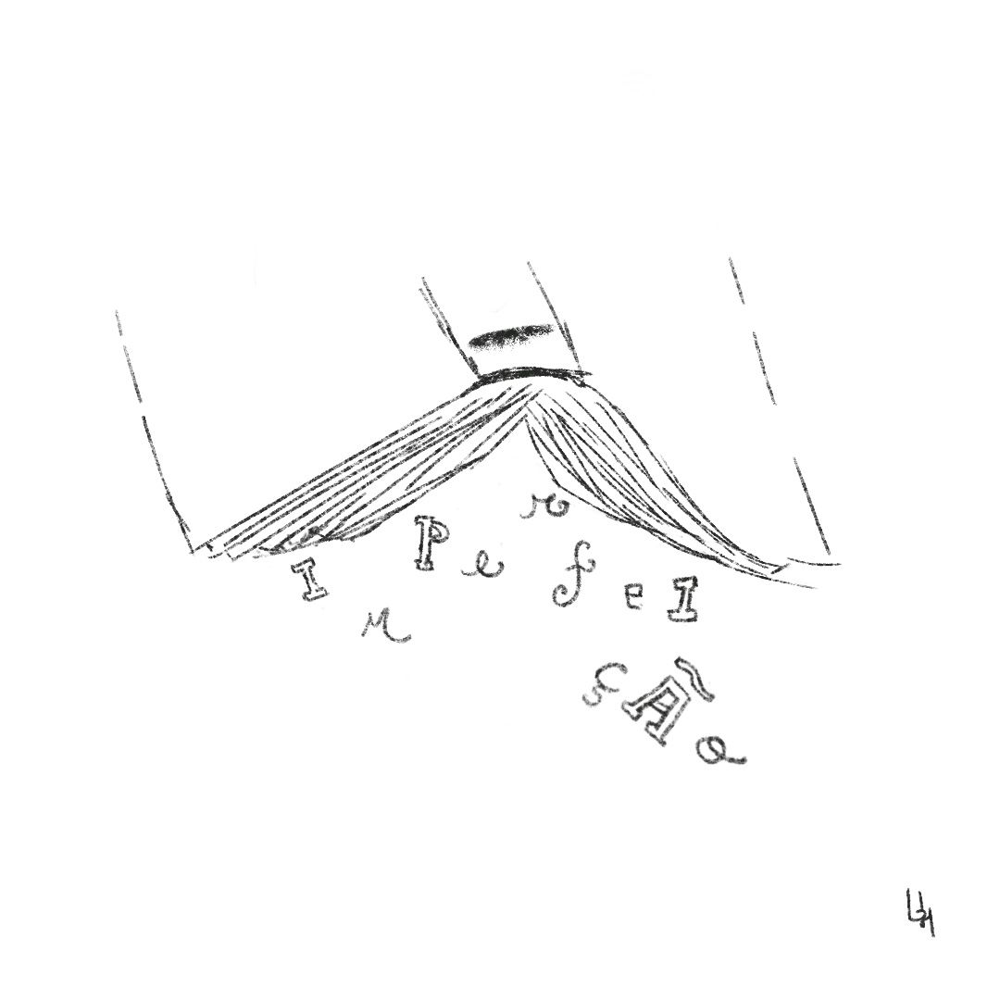

# A biblioteca viva

Era uma vez uma biblioteca comum, cuidada por um bibliotecário tão comum quanto a mesma. No entanto, ambos estavam repletos de vida. 

Todos os dias o bibliotecário tinha de organizar dezenas de livros, em um trabalho muito repetitivo, mas nunca deixou de se surpreender com a perfeição de suas capas.

– Esse título não poderia ser melhor! E essa ilustração, impecável! – sempre dizia o bibliotecário.

No entanto, nunca teve coragem de abrir ao menos um deles. Era como se fosse o suficiente apenas conhecer as capas dos livros.

O seu trabalho era árduo e muitas vezes o bibliotecário se sentia incapaz de fazê-lo corretamente. Sentia-se sem forças e cheio de desafios, perdia a esperança e guardava tudo isso dentro de si.

Sempre dispunha um semblante elegante, pacífico e feliz, é claro. Como poderia exercer suas funções se assim não fosse?!

Entretanto, isso o fazia se sentir solitário no mundo. Olhava todos esses livros perfeitos em suas estantes, que aparentavam ser tão cheios de vida e amor, mas não sentia o mesmo sobre si.

Até desejou ser como a capa de qualquer um daqueles livros. Somente assim poderia se sentir completo.

Outro dia, estava organizando os livros, como de rotina, mas sem querer derrubou um deles. A capa do livro havia sido arrancada fora.

Logo percebeu que as páginas que estavam ali abertas no chão não pareciam em nada com a capa arrancada fora.

Elas pareciam... imperfeitas. Com riscos, manchas de tinta e anotações por todos os lados. Foi impossível evitar folhear mais páginas.

Descobriu que, assim como ele se sentia, aquele livro era imperfeito, mas também era único. As escritas que ali encontrou o fizeram se sentir especial por ser quem ele era e as ilustrações lhe deixaram com vontade de saber mais.

Assim, ele percebeu que não estava mais só. As imperfeições ali encontradas no livro, de alguma forma, eram sobre ele também.

Sua vida mudou desde então. Hoje, sempre que se sente sozinho e imperfeito, ele simplesmente lê algum livro da biblioteca com muito amor e carinho.

Decidiu até escrever o seu próprio livro e colocá-lo na biblioteca, para que outros leitores pudessem lê-lo e nunca mais se sentir desconectados com a vida, como ele estava.

### Olhando por aí

Essas palavras foram inspiradas no projeto [Human Library (Biblioteca Humana)](https://humanlibrary.org/), uma iniciativa que publica pessoas como livros abertos, para reconstruir nossos julgamentos sobre os outros.

### Rabiscando Denovo

Essa semente foi originalmente publicada no meu ko-fi em 18 de abril de 2023, mas aí decidi plantar ela aqui também.