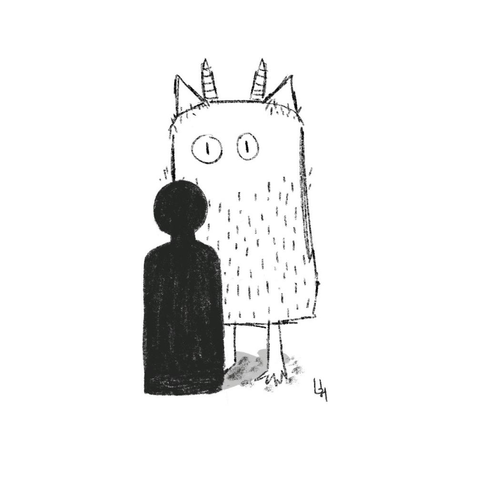

# Como estou enfrentando meu monstro hoje? (parte 2)

---

> Essa reflexão é uma ramificação de [Qual é o monstro que estou enfrentando hoje? (parte 1)](../2023-10-25-qual-e-o-monstro-que-estou-enfrentando-hoje-parte-1/content.md).

---

Não sei se o termo enfrentar consegue abarcar todas as formas de me envolver com os meus monstros.

Só enfrentar parece perigoso, incompleto e ineficaz. Talvez seja mais real se eu também puder aceitar e ignorar o monstro.

Reconhecer o monstro também parece importante. É o primeiro passo antes de todos os outros.

Só que não se engane ao pensar que ele não existe enquanto eu não o reconhecer. Eu só não sei dele ainda, mesmo ele sabendo tudo sobre mim.

Enfrentar o monstro não se parece em nada com uma luta de gladiadores, em que lutam até restar apenas um vencedor.

É uma coisa que leva tempo. Semanas, meses, anos ou até mesmo toda uma vida. Não é sobre encontrar um fim, mas sobre trilhar um caminho.

E não há caminhos nessa vida sem paciência. O trajeto não existe em um dado momento e só o tempo poderá falar sobre ele.

Muitas escolhas são feitas nesse trajeto e quando as observo por algum tempo, vejo que estou cheio de hábitos, positivos ou negativos.

Meu monstro também é obrigado a seguir meus hábitos e é influenciado por eles. Quando eu não me perdoo pelos meus erros rotineiramente, meu monstro também não me perdoa e faz eu me sentir mal.

Mas quando eu vivo com gratidão e cheio de esperança, o monstro vai deixando de ser monstro e vira apenas uma lembrança, uma memória e uma história.

Hoje, sinto que a melhor forma de me relacionar com meu monstro vem das minhas pequenas, mas repetidas escolhas.

Como consegui enfrentar o meu monstro de hoje? Só o tempo me dirá, mas com certeza estará repleto de boas escolhas, as minhas escolhas.

E, pessoalmente, eu tenho escolhido viver mais próximo da natureza, mais devagar na minha vida, focando no mínimo possível em troca do máximo de mim e buscando ajuda sempre que preciso, inclusive em momentos de choro.

Essas são as minhas escolhas e, provavelmente, não serão as suas. Então me conta, o que tem lhe ajudado a enfrentar o seu monstro?

---

### Um pouco mais

Eu realmente acredito em uma vida mais minimalista, inspirada na Lei de Paretto: se você descobrir os 20% mais significativos da sua vida, você terá encontrado pelo menos 80% do que você precisa.
