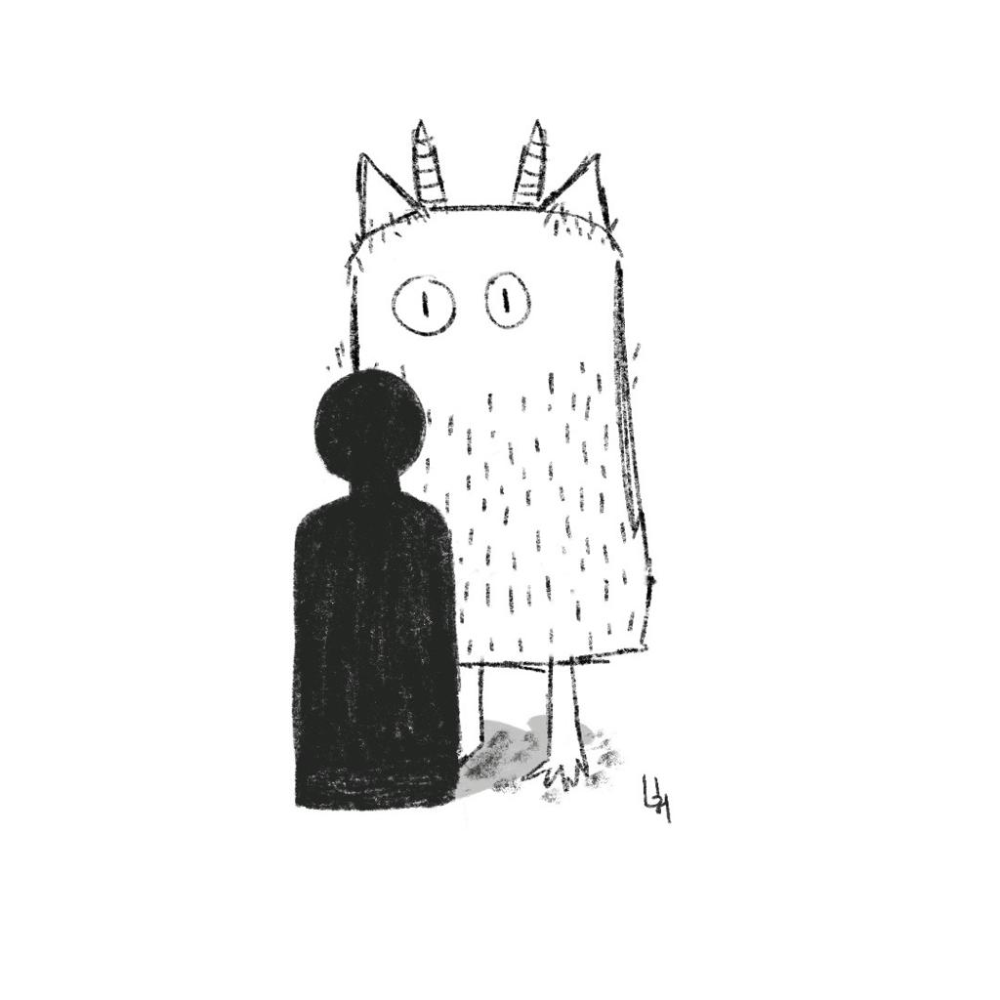

# Qual é o monstro que estou enfrentando hoje? (parte 1)

Que todos temos monstros a enfrentar ao longo da vida, já sabemos. Mas qual estou enfrentando hoje?

Pergunta difícil... talvez porque ter consciência do monstro me faça sentir-me mais vulnerável, talvez porque sejam vários deles e é difícil identificar um só.

O monstro também pode ser atemporal. Ele não precisa ter nascido hoje, e sim estar viajando do passado ou futuro para me fazer visitas inesperadas no dia-a-dia.

Ele também não tem hábitos fixos. Às vezes aparece para dar boa noite (ao menos para ele) ou até mesmo para invadir a minha privacidade no banho.

E ainda pode ser muito carente e sugar toda a minha atenção (e energia), bem como egoísta e não deixar eu fazer o que quero.

O monstro às vezes está de férias, mas geralmente gosta de me acompanhar nos meus afazeres e dar palpite a todo instante.

Nem sempre sei como chamá-lo. Ele pode responder por nomes curtos, como "medo" ou "vazio", ou através de combinações de palavras quase que poéticas, como "ansiedade antes das reuniões" ou "síndrome do impostor".

Tem dias que o monstro está cansado de me ver realizado, rindo de pequenas bobagens ou abraçando pessoas que amo.

Já em outros, ele que me cansa, me deprime, esgota a minha energia e mexe com a minha esperança.

Um monstro nunca é igual ao outro, nem os meus, nem os dos outros. Também não dá para comparar eles e nem achar um pior ou melhor.

Só que tem uma coisa em comum em todos eles: fazem parte da minha história e, apesar de me trazerem a dor e a dúvida, também me ensinam a ser quem eu quero ser e ter a coragem para fazer o que quero fazer.

Acho que o meu monstro da vez pode ser chamado de "lado preocupante e negativo da vida" e ele adora tirar o meu foco das maravilhas no meu dia-a-dia para só ficar pensando e criando problemas.

E você, qual é o monstro que está enfrentando hoje?

----------

Essa reflexão ramifica para [Como estou enfrentando meu monstro hoje? (parte 2)](../2023-10-25-como-estou-enfrentando-meu-monstro-hoje-parte-2/content.md).

----------

### Rabiscando Denovo

Essa semente foi originalmente publicada no meu ko-fi em 14 de abril de 2023, mas aí decidi plantar ela aqui também.
