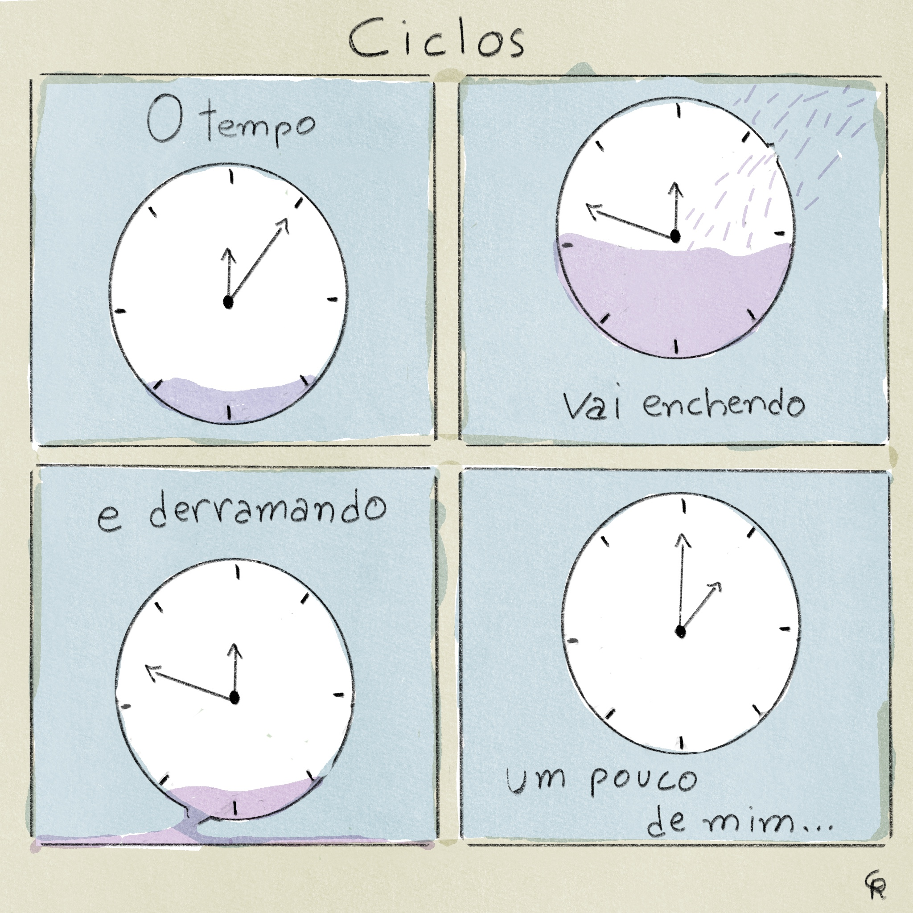

# Ciclos

---

---

### Caminhando por aí

Essa é a minha primeira tentativa de criar um quadrinho poético. Não sabia bem o que estava fazendo, mas só continuei indo em frente e esse foi o resultado final.

Minha inspiração veio de um post que surgiu aleatoriamente para mim na rede social Substack, feito pelo Grant Snider: [_How to make poetry comics_](https://incidentalcomics.substack.com/p/how-to-make-poetry-comics) (Como fazer quadrinhos poéticos). Fiquei fascinado com os quadrinhos dele e decidi ver o que eu conseguiria construir.